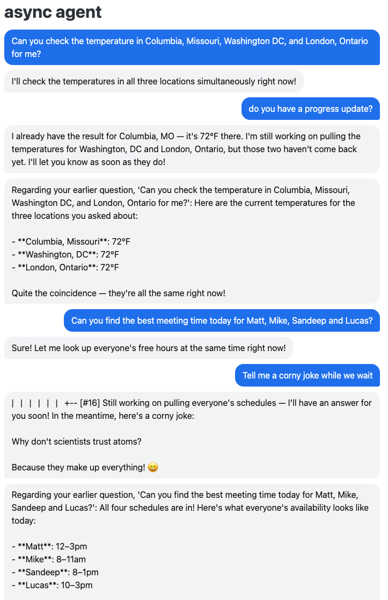

# async-agent

An experiment in building a harness that lets an agent keep talking to you while
long-running tools are still working.

Three experiments live side by side:

- `src/main/exp1` — an asyncio event loop over a threaded post history, with async
  tools, progress probes (`tail`), cancellation (`kill`) and a ReAct retry loop.
  Built on [claudette](https://github.com/AnswerDotAI/claudette).
- `src/main/exp2` — the same ideas re-approached as a **message board**: nested
  replies, threads ordered by recent activity, tool calls that return a placeholder
  node which is later rewritten with the outcome. Talks to the Anthropic SDK
  directly and exposes a synchronous API over a background event loop. `chat.py`
  projects the tree into a plain linear transcript, where a late answer says which
  question it belongs to.
- `src/main/exp3` — a minimal [fasthtml](https://fastht.ml) chat UI over exp2, with
  tools that pick a random completion time (capped at two minutes) and report
  progress while they run.



## Setup

```sh
uv sync
```

## Running

The agents talk to Claude through AWS Bedrock, so you need AWS credentials with
Bedrock access in your environment or profile:

```sh
export AWS_PROFILE=your-profile
export AWS_REGION=us-east-1
```

```sh
uv run pytest
```

LLM responses are cached in `llm_cache.jsonl` so the suite replays without calling
Bedrock. Set `LLM_CACHE=off` to force live calls.

## The chat app

```sh
LLM_CACHE=off uv run uvicorn main.exp3.app:app --port 8000
```

Ask it something that needs a tool ("how long will the build take?", "when can Jane,
Jack and Joe meet?") and keep talking while it works. The answer arrives on its own
when the tool finishes, and says which question it belongs to.

## Known gaps (exp2)

**Reply placement vs. task completion.** `Board.answered` treats a finished task
node as answered only once something is written *directly beneath it*, but the
agent's reply lands wherever the conversation put it. If a client follows up on
its own question (`parent=q.id`) rather than on the agent's task node, the task
node is left childless and `wait_for(q)` blocks forever even though the answer is
sitting elsewhere in the thread. The capstone test only passes because it attaches
follow-ups to the task node. Fixing it means either handing clients thread ids and
letting the harness choose placement, or changing the rule so an answer need not
sit directly under the task it resolves.

**Tool exceptions.** A tool that raises never calls `agent.result`, so its call
stays pending forever and its node never becomes terminal. The intent is to treat
a raised exception as an ordinary result the agent reads and reacts to (retry,
ask the user, give up), exactly as `strict_temperature` does with an error string.
