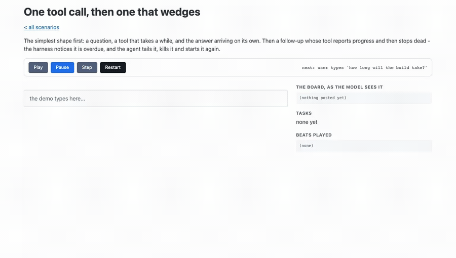

# async-agent

> **Write-up:** [Towards a responsive agentic behavior](https://pslusarz.github.io/articles/2026/10/01/an-agent-you-can-interrupt.html)
> — why an event loop is enough to produce ReAct, what breaks once a tool outlives the
> turn that called it, and how this compares with Anthropic's Claude Agent SDK.
>
> **Demo:** [async-agent-demo-production.up.railway.app](https://async-agent-demo-production.up.railway.app)
> — the harness running three scenarios you can play, pause or step through a beat at
> a time, with the agent's board beside the chat. Nothing calls a model.

A proof-of-concept harness for an agent you can keep talking to while its tools are
still running. The write-up above explains the design and what it is for; this file is
about the code.

The demo, played through: a tool reports progress and then wedges, the harness notices
it is overdue, and the agent tails it, kills it and starts a fresh call that completes.



## Layout

Two lines of experiment, not one design. Nothing is factored for reuse, and each
experiment builds on the one before it rather than replacing it.

| | |
|---|---|
| `src/main/bedrock.py` | Claude via AWS Bedrock, plus the response-cache wrapper |
| `src/main/exp1` | asyncio event loop over a threaded post history. Frozen, kept for comparison |
| `src/main/exp2` | the same ideas as a **message board**: `board.py` the tree, `run.py` the tool contract (`run`/`tail`/`stop`), `chat.py` the linear projection the reader sees |
| `src/main/exp3` | a fasthtml chat UI over exp2 |
| `src/main/exp5` | exp2 plus **timeouts**: every tool schema gains an injected `timeout`, and lapsing puts an `overdue` event on the queue |
| `src/main/exp7` | exp5 with running tasks drawn — spinners and dots beside the turn that started them |
| `src/main/exp7demo` | the public demo: canned replies, scripted tools, play/pause/step |
| `src/main/exp9` | **subagents**, on LangGraph and deepagents' `AsyncSubAgent` — none of our harness underneath |
| `src/main/exp4`, `exp6` | the control — the whole thing again on the Claude Agent SDK, then timeouts on top |

The tools are toys — a thermometer, a calendar, a build timer — picked because they
finish at inconvenient moments.

## exp9: the same behaviour, built out of LangGraph

exp9 asks whether a stock LangChain stack can be made to behave the way the harness
does — talk while work runs, watch it, and come back with the answer unasked. Two deep
agents are registered in `langgraph.json` and served by `langgraph dev`; the supervisor
delegates through `AsyncSubAgent`, so a subagent is a thread and a run on an Agent
Protocol server; the chat app is a plain SDK client that posts each turn as a run with
`multitask_strategy="enqueue"` and draws the `async_tasks` state channel.

Out of the box it is **pull-only**. The middleware's five tools can start, check,
update, cancel and list, and that is all: a run ends on the server and the supervisor
is none the wiser until the person asks it to check. `check_async_task` returns a
status and, once the run is over, the final message — there is nothing to watch while
it works. The first version of this app showed the researcher finished, its three
lookups green and its answer sitting in its own thread, while the supervisor still
said "running" and volunteered nothing.

Two small tools in [src/main/exp9/watch.py](src/main/exp9/watch.py), both built from
plain SDK calls, close the gap:

- `peek_async_task` reads the subagent's own thread state — its latest words and the
  tools it has started and finished. That is `tail`, and the data was there all along;
  the supervisor just had no way to ask for it.
- `check_back_in` schedules a run on the supervisor's *own* thread with
  `after_seconds`, so the server wakes it later with a note it wrote itself. Creating
  one cancels the pending one first, so exactly one wake-up is ever armed. That is the
  timer, and with it the agent reports the answer without being asked.

What is left over after that:

| | the harness | exp9, on LangGraph |
|---|---|---|
| who arms the timer | the harness, off the tool call, with the model's estimate as the interval | the model, by remembering to call `check_back_in`. Forget once and it never comes back |
| what wakes it | the task settling pushes a `result` event: the answer is immediate and exact | a timer in front of a poll. A webhook on the subagent's run would be a real push, but `start_async_task` does not pass one |
| asides | the board marks words the harness asked for, and the reader never sees them | the nudge is an ordinary user message in the one list, so the app filters it out by its prefix |
| staying out of the way | the agent cannot wait on a background call even if it wants to | it will happily poll inside the turn it started the task in; only prompt discipline stops it |
| changing your mind | `steer` leaves the work running and changes what is owed | `update_async_task` re-runs the thread with `multitask_strategy="interrupt"`: history survives, the in-flight tool call does not |
| where task state lives | the board, as the placeholder the call left behind | `async_tasks`, a channel kept out of the messages so summarisation cannot drop it |
| what a subagent is | a `Work` on a thread in this process | a thread and a run on a server: outlives the supervisor, scales on its own, traced in LangSmith |

So the answer is yes, with about sixty lines: nothing in LangGraph prevents an agent
from being aware of its own long-running work. What the stack does not give you is the
*default* — the push, the progress, and the distinction between words meant for the
person and words the harness asked for.

## Setup

```sh
uv sync
```

Everything except `exp7demo` talks to Claude through AWS Bedrock, so a live run needs
credentials:

```sh
export AWS_PROFILE=your-profile
export AWS_REGION=us-east-1
```

## Tests

```sh
uv run pytest
```

130 tests. The default run is the 113 that replay from `llm_cache.jsonl`, so the suite
finishes in seconds without calling Bedrock; `LLM_CACHE=off` forces live calls. A cold
run still needs credentials, because the client is built before any cache lookup.

The other 17 are excluded by default and run on demand:

```sh
# exp5's one realtime test: two timer-driven turns spaced by model latency
AWS_PROFILE=staging AWS_REGION=us-east-1 LLM_CACHE=off \
  uv run pytest src/test/exp5 -m realtime -n0

# exp4: record against Bedrock, then replay with no credentials at all
AWS_PROFILE=staging AWS_REGION=us-east-1 CLAUDE_CODE_USE_BEDROCK=1 \
  uv run pytest src/test/exp4 -m live -n0
CLAUDE_CODE_USE_BEDROCK=1 \
  uv run pytest src/test/exp4 -m 'live and not realtime' -n0

# exp6 drives the same SDK, but its tests are all realtime
AWS_PROFILE=staging AWS_REGION=us-east-1 CLAUDE_CODE_USE_BEDROCK=1 \
  uv run pytest src/test/exp6 -m live -n0

# exp9 needs the Agent Protocol server; the fixture starts one if none is up
AWS_PROFILE=staging AWS_REGION=us-east-1 \
  uv run pytest src/test/exp9 -m live -n0
```

Record with `-n0`: cachy rewrites the whole file per entry, so parallel workers lose
each other's writes.

Things worth remembering:

- Assert on data, not on the model's phrasing. Several tests have broken because they
  checked for particular wording in a reply.
- A cached bad response replays forever. After changing a prompt, delete
  `llm_cache.jsonl`, re-record, and dedupe it (keep last per key, sort by key).
- Replaying removes latency, which changes thread scheduling. Async code that relied on
  an LLM call to yield needs a real suspension point.
- `realtime` tests cannot be replayed at all — they assert on the interleaving the
  cache removes.

## Running the apps

```sh
# the chat app (exp3), against a live model
LLM_CACHE=off uv run uvicorn main.exp3.app:app --port 8000

# the subagent chat app on LangGraph (exp9): the graphs server first, then the app
uv run langgraph dev --no-browser --no-reload --n-jobs-per-worker 10
uv run uvicorn main.exp9.app:app --port 8000

# the demo app (exp7demo), no model, no credentials
DEMO_SECRET_KEY=dev uv run uvicorn main.exp7demo.app:app \
  --port 8000 --timeout-graceful-shutdown 3
```

For the chat app, ask for something slow ("how long will the build take?", "when can
Jane, Jack and Joe meet?") and keep talking while it works.

Deploying the demo, and its operational traps — session affinity, SSE buffering,
graceful shutdown — are in
[.github/skills/exp7-demo-deploy/SKILL.md](.github/skills/exp7-demo-deploy/SKILL.md).

## Caching, which is not optional

Sixteen live SDK tests, minutes rather than seconds, every run billed and every run
needing credentials. At that price you stop re-running them, and then you stop trusting
them. The board experiments solved this long ago by patching `httpx` in-process, which
is all [pycachy](https://github.com/AnswerDotAI/cachy) does. Doing the same for the SDK
ones took a day, and it is worth being specific about why:

- **There is no support for this.** The Agent SDK documentation has no page on testing,
  mocking or replay, and the issue tracker has no accepted pattern for it.
- **In-process patching cannot work.** The model calls happen inside the SDK's bundled
  **Node** CLI. No amount of patching Python reaches a subprocess, which also rules out
  `vcrpy` and `pytest-recording`. The only seam left is the wire, so the cache is a
  proxy on localhost that the CLI is pointed at with `ANTHROPIC_BEDROCK_BASE_URL`.
- **The request has to be re-signed.** SigV4 covers the `Host` header, so the CLI's
  signature is void the moment the endpoint changes to localhost. The proxy signs again
  on the way out. Replays need no credentials at all, because the cache key ignores
  headers.
- **Bedrock is not JSON.** Responses stream binary `application/vnd.amazon.eventstream`,
  which has to survive the round trip byte-for-byte.
- **Three kinds of id are minted per run** — the session id, the agent ids, and the task
  output paths under `/private/tmp` — and all of them are echoed back into the next
  request. They are renumbered by order of first appearance rather than flattened to one
  value, because flattening makes two requests that differ only in *which* of three
  concurrent agents finished hash identically.
- **One of those patterns matched `9007199254740991`.** It is `MAX_SAFE_INTEGER`, it
  appears as a `maximum` in the tool schemas, and it is sixteen characters of valid hex.
  Matching it shifted every id numbered after it.
- **The CLI reports `duration_ms`.** A replay does not spend that time, so the recording
  and the replay disagree about a number neither of them chose.
- **Some tests cannot be cached at all.** Several assert on interleaving or on a
  wall-clock timer, and latency is exactly what the cache removes. They are marked
  `realtime` and run live. A response cache can replay what was said; never when.

The implementation is [src/main/exp4/cache.py](src/main/exp4/cache.py). The cacheable
tests replay in under a minute with `AWS_ACCESS_KEY_ID` set to nonsense.

## Known gaps

- **Reply placement vs. task completion.** A node is treated as answered when something
  is written directly beneath it, but a reply can land elsewhere in the thread. Follow
  up on your own question rather than on the agent's and the task node is left childless,
  waiting forever for an answer that already exists a few lines away.
- **The agent's restart is silent.** exp5's `SPEAKS` rule only lets a turn speak when the
  user triggered it or a result landed, so a turn driven by an overdue timer — tail, kill,
  retry — leaves the board intact but says nothing to the reader.

More detail, and the conventions an agent working in this repo should follow, are in
[.github/copilot-instructions.md](.github/copilot-instructions.md).

## Licence

MIT. See [LICENSE](LICENSE).
