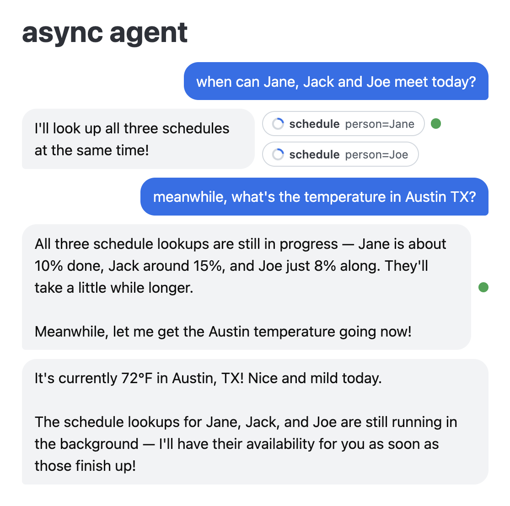

# async-agent

If you have ever typed a steering message to GitHub Copilot while it was waiting on
a long-running tool, and watched your message sit there until the tool finished, you
already know this is not a solved problem, not even for the people building the
leading agents.

This is a harness for the other way round: an agent you can keep talking to while
its tools are still working. Ask it something slow, ask it something else while it
waits, ask how the first one is going, change your mind and cancel it. Answers
arrive when they are ready and say which question they belong to.



Layout, setup, how to run the tests and the chat app, and the known gaps are in
[.github/copilot-instructions.md](.github/copilot-instructions.md).

## How it works

The question here is how to get a turn-based LLM to cope with answers landing at odd
intervals while the conversation carries on around them.

Two pieces do most of the work: a small **event loop** and a conversation kept as a
**message board**.

The event loop gives you a ReAct agent almost for free. Anything a tool reports is an
event, and when one arrives the agent gets another turn, so it can chain a second
tool, retry a failed call with corrected arguments, or just answer. None of those
need special handling.

The loop leaves the harder parts open: tying a result to the request that wanted it,
possibly many exchanges back, deciding what to do when only some of the answers are
in, and letting the agent look in on a slow tool and give up on it.

The board covers those. The person chatting never sees it, but the agent reads it
every turn:

- **Threads reorder as they are touched.** The thread with the newest activity is
  rendered last, right where the agent is about to reply.
- **A running tool call is a placeholder saying what can be done with it:**
  `[schedule(person='Jane') is running as task #5. You may inspect progress with
  tail(task=5); terminate it with kill(task=5). This placeholder will be replaced by
  the outcome when the task finishes or is killed.]`
- **When it finishes, the placeholder becomes the outcome:**
  `[schedule(person='Jane') returned: free 9-12]`
- **One turn is one node**, holding everything the agent said and every call it made
  at once. A node is finished only when all of its calls are, so the agent answers a
  two-person calendar question once instead of twice with half the answer.
- **Only the recent part of the board changes.** Once a node's tools have landed it
  stops being rewritten, so the earlier part of the transcript stays stable and
  cacheable while the tail of it is still moving.

Tools run on their own threads behind a small interface, described in [The tool
contract](#the-tool-contract) below: `tail` to ask how it is going, `kill` to stop
it. A finished tool settles a `Future`, which wakes the loop and gives the agent a
turn to say something about it.

None of this reaches the user. `Chat` flattens the board into an ordinary linear
conversation with role, text and timestamp. When an answer arrives long after the
question it belongs to, it says so: *"Regarding your earlier question, 'how long will
the build take?': ..."*

## The tool contract

A tool that blocks the conversation while it works defeats the point, so every tool
here is something the harness can start, look in on, and give up on. Three methods,
and no reference to the agent, the board or the node it was called from:

```python
class Task(Protocol):
    def run(self) -> str: ...  # do the work, return the value
    def tail(self, lines: int) -> str: ...  # what is going on right now
    def stop(self) -> None: ...  # wind-down requested, called from another thread
```

A tool's entry point is a factory: it takes the arguments the model supplied and
returns a `Task`. The harness does the rest.

**The harness owns the thread.** `Runner` starts the task, and whatever `run`
returns settles a `concurrent.futures.Future` whose done-callback wakes the event
loop. The tool never calls back into the agent.

**Raising is a result.** A tool that throws settles with `failed: ...` rather than
leaving its call pending forever. The agent reads the failure like any other
outcome and decides whether to retry, ask, or give up. This is why the contract
returns a value instead of taking a callback: a callback that is never reached is
invisible, an exception is not.

**`tail` says how much you want.** The meta tool is `tail(task, lines)`, so the
agent can glance at one line or read the last twenty. Output goes onto the board
permanently, so the default is small.

**`kill` is cooperative, because it has to be.** A Python thread cannot be
interrupted. `kill` calls `stop()`, waits a short grace period for the task to wind
down, and then stops caring. A task that ignores `stop` can only be abandoned, and
the harness is honest about that rather than pretending otherwise.

**A killed task stays killed.** Whatever a task settles with after it was killed is
dropped rather than posted. A decision to stop is not undone a moment later by a
result arriving from the work that was stopped.

Most tools do not want to implement `tail` and `stop` themselves, so `Work` provides
them: a `status` line, a bounded log, and a stop flag. Subclasses implement `run` and
call `beat()` wherever they can afford to pause — which is both where progress is
reported and where a stop request is delivered, the way a Temporal activity heartbeat
doubles as its cancellation point.

```python
class Countdown(Work):
    def __init__(self, value: str, seconds: float):
        super().__init__()
        self.value, self.seconds = value, seconds

    def run(self) -> str:
        due = time.monotonic() + self.seconds
        while (left := due - time.monotonic()) > 0:
            self.status = f"still running, about {max(0, round(left))}s to go"
            self.beat(min(0.05, left))
        return self.value
```

A tool that never calls `beat` is a tool that can only be abandoned. `stuck_temperature`
is exactly that, on purpose.

## What the board looks like

Three calendars were requested at once. Two came back quickly, Joe's did not, and the
user asked for an update while it was still running. Here is the board at that
moment. `..` marks something still owed an answer, `ok` something settled.

```
.. #1 user   'when can Jane, Jack and Joe meet?'
  .. #2 agent  'Let me check all three schedules at the same time!'
          call #3 schedule(Jane) -> 'free 9-12'
          call #4 schedule(Jack) -> 'free 10-14'
          call #5 schedule(Joe)  -> PENDING
    ok #6 user   'how is that going?'
      ok #7 agent  'Let me check on that for you!'
              call #8 tail(5) -> '5% done, about 85s to go'
        ok #9 agent  "Still working on Joe's schedule, only about 5% of the way"
```

A few things to notice:

- **#2 is one turn holding three calls.** Two have results, one is still out, so the
  node is unfinished and #1 stays unanswered. The agent will not try to schedule a
  meeting from two thirds of the answer.
- **The progress question stands on its own.** #6 was asked and answered, so it is
  settled even though the thing it asked about is not.
- **Checking on a task is just another tool call.** `tail` is recorded at #8 the same
  way as the calendar lookups, with an immediate result.

The same moment, as the person chatting sees it:

```
YOU   | when can Jane, Jack and Joe meet?
AGENT | Let me check all three schedules at the same time!
YOU   | how is that going?
AGENT | Let me check on that for you!
AGENT | Still working on Joe's schedule, only about 5% of the way through with
        roughly 85 seconds to go.
```

No ids, no tasks and no tree. When Joe's calendar lands, the agent will come back on
its own with the meeting time.

## Project status

This is a proof-of-concept experiment, not a framework you can drop into something.
It exists to find out which problems a harness like this has to solve, and there have
been more of them than I expected. If there is interest it could grow into a library.

What that means in practice:

- There are three experiments in the repo, not one design. `exp1` is an asyncio event
  loop, kept frozen for comparison. `exp2` is the same ideas rebuilt as the message
  board. `exp3` is the chat UI over it. Nothing is factored for reuse.
- The tools are toys: a thermometer, a calendar, a build timer, picked because they
  finish at inconvenient moments.
- Some real gaps are still open. A reply can land somewhere the board does not
  recognise as answering the question, and the agent gets only one look at a running
  task per turn, so it cannot tail twice or tail and then kill in one breath. Both are
  written up in the [known gaps](.github/copilot-instructions.md).

For what does work, the tests are the best guide: 90 of them, covering the tool
contract itself, progress probes, cancellation, tools that raise, retries after a bad
call, several tools running at once, and a browser driving the real app.
